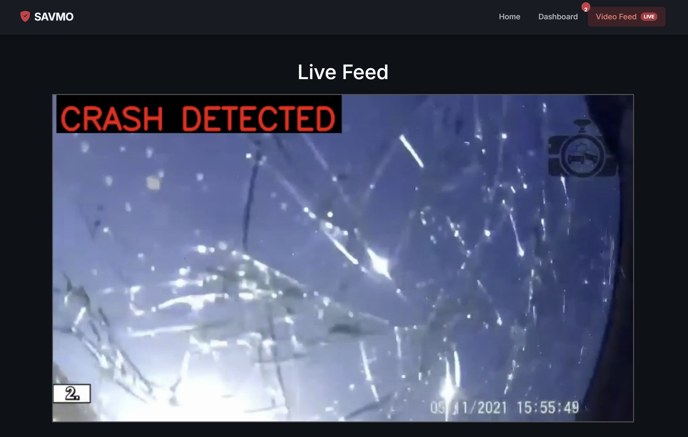
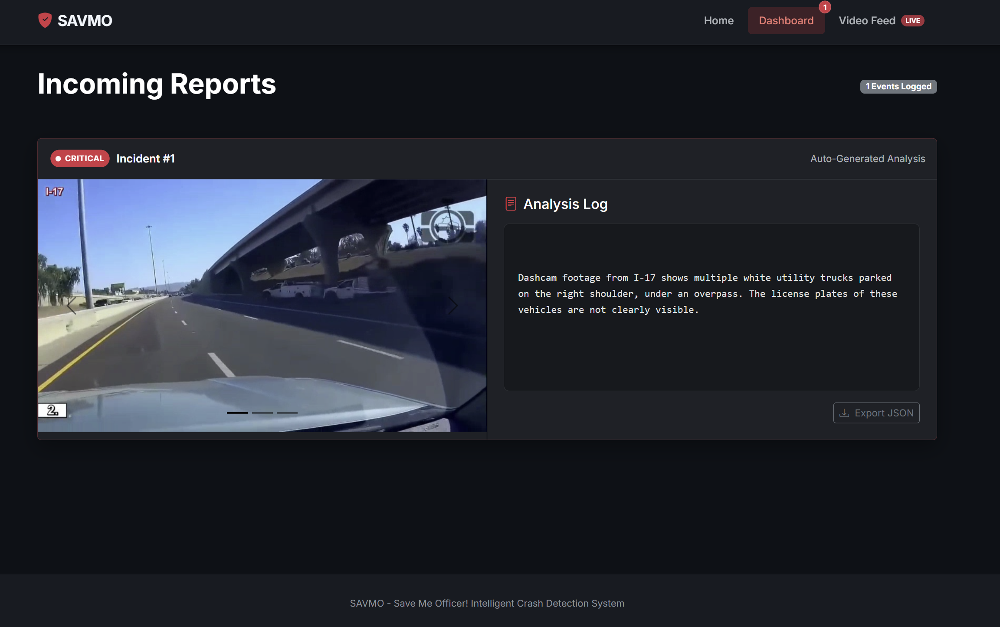

# SAVMO (Save Me Officer!)

# Introduction

Initially, SAVMO was built in 24hrs as part of the MAIS HACKS 2025 hackathon, and ended up winning "Best Hack For Impact" category! However, since then major changes were made to shape it up to a proper project, including: implementing handling concurrent users, a proper UI with a clean dashboard, updating the model by packaging it with ONNX, packaging it as a Docker container to be potentially deployed.

The goal of SAVMO is to detect if the driver crashed, based on live dashcam footage. Once a crash is detected, SAVMO will generate a summary of the crash, and transfer it (along with key frames from the crash) to the SAVMO dashboard.

Here is a look of the live detection feed: 

As well the as dashboard itself: 

The dashboard is ideally to be used by emergency responders, or could be sent out to close relatives of the owner of the dashcam in order to let them know that a crash occured.

# Replication

If you have Docker, you can simple run `docker compose up` and the project will be available at port 8000 by default, but you can change it to anything in the `docker-compose.yaml`

Here are the main elements of the project:

- `/website`: this directory holds the full SAVMO website, which can be deployed as-is, by cloning the directory and running `python app.py`.
- `model-creation/`: this holds all the necessary code that was used to train the model, export it as an ONNX model and testing if the ONNX model matches with the initial model.
- `data-prep/`: this has all the code that was used in order to extract all the individual frames from our test and train videos and all necessary preparation for the model itself.

# Model Information

We fine-tuned the ResNet18 model based on the [Car Crash Dataset](https://www.kaggle.com/datasets/asefjamilajwad/car-crash-dataset-ccd/data). Due to our time constraints, we trained the model on randomized frames, but a future implementation could be to use a sequential model to use context of the entire video.

After fine-tuning, we got the following confusion matrix, when testing on 20% of our 75k images:

| Truth / Prediction | No Crash | Crash | Accuracy |
| :----------------- | :------: | ----: | -------: |
| No Crash           |  10838   |   319 |      97% |
| Crash              |   317    |  3526 |      91% |

Which is a satisfactory performance, but could be improved in the future.
